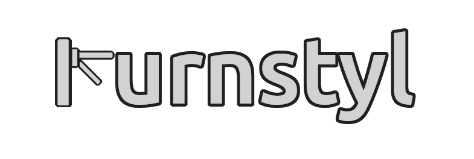

Turnstyl is an NPM package built to work with Kafka and other message brokers to allow you to compare the data schema input at the producer level to what arrives into your data warehouse.

The aim of Turnstyl is to monitor and notify the user of data validity issues in your data pipeline, specifically at the fringe between backend and ETL systems. Turnstyl was primarily designed for use in micro-service architecture where events are dumped into a data warehouse in a generic and schema-agnostic format.

## ✅ Pre-requisites

---

To run this package you'll need to have:

- A working instance of Kafka or equivalent message broker
- Be setup and using Google BigQuery as your data warehouse
- Have activated the Google API and setup a [service account](https://cloud.google.com/iam/docs/creating-managing-service-accounts)

## 🚀 QuickStart

---

Getting started with Turntstyl is easy:

1. In your terminal run `npm install turnstyl` in your target project directory
2. Create a `turnstyl.config.yaml` in your project root directory, using the template below to input your Google Big Query project and dataset names, and the path to your Google API service account credentials JSON.

Example `turnstyl.config.yaml` file:

```yaml
version: '1.0'

google_service_credentials: './GOOGLE_BIG_QUERY_SERVICE_ACCOUNT_CREDENTIALS.json'
big_query_project_name: 'BIG_QUERY_PROJECT_NAME'
big_query_dataset_name: 'BIG_QUERY_DATASET_NAME'
```

3. Import the package into the service where data is being sent to your producer

`const { Turnstyl } = require("turnstyl");`

4. Instantiate a new `Turnstyl` object and invoke the following two methods:

`const newTurnstyl = new Turnstyl();`

- `newTurnstyl.cacheProducerEvent(topic, message);` - Caches your events where they are produced (or in the producer) and with reference to the topic that they will be sent through, parsing the object for it's data types.
- `newTurnstyl.compareProducerToDBSchema(topic);` - Compares the events that have arrived into Big Query (assuming the topic name matches your target table) flagging if there is a discrepancy between the two.

## ✨ Features

---

- Compare data object processed by the producer to the JSON deposited in the data warehouse
- Integration with Google Cloud Platform (Big Query)

## 🛠️ Example usage

---

```js
const { Kafka } = require('kafkajs');
const { Turnstyl } = require('turnstyl');

const newTurnstyl = new Turnstyl();

/**
 * @function producer function that connects to Kafka sends a message then disconnects
 * @param producerName STRING name of producer
 * @param message STRING message that will be sent to Kafka
 * @param topic STRINg name of the topic that message will be posed to on Kafka
 */
const producer = async (
  producerName
  message
  topic
) => {
  //Declare a variable kafka assigned to an instance of kafka (door into the kafka brokerage)
  const kafka = new Kafka({
    clientId: producerName,
    brokers: ['kafka:9092'],
  });
  const producer = kafka.producer();

  newTurnstyl.cacheProducerEvent(topic, message);
  newTurnstyl.compareProducerToDBSchema(topic);

  try {
    // Connect to the producer
    await producer.connect();
  } catch (error) {
    console.log('Producer Connection error: ', error);
  }

  try {
    // Send message
    await producer.send({
      topic: topic,
      messages: [{ value: JSON.stringify(message) }],
    });
    console.log('message is:', message);
  } catch (error) {
    console.log('error in message send', error);
  }
  console.log('Data sent by producer');
  // Close connection to the broker
  producer.disconnect();
};

export { producer };
```

## 🏭 Supported Data Warehouses

---

- Google Big Query

## 👍 Contribute

---

### Contributors:

[Jae Kim](https://github.com/jaeklm) | [Yolan Arnett](https://github.com/yarnett) | [Dillon Schriver](https://github.com/Dillon-Schriver) | [Emeric David](https://github.com/emeric-gh) | [Michael Colley](https://github.com/michaelecolley)

---

If you'd like to support the active development of Turnstyl:

- Add a GitHub Star to the project
- Tweet about the project on your Twitter.
- Write a review or tutorial on Medium, Dev.to or personal blog.

## 🎟️ License

---

`Turnstyl` is free and open-source software licensed under the MIT License.
